# HCT Prediction System - Architecture Diagrams

## System Overview

This document contains detailed Mermaid diagrams for the HCT Prediction System architecture.

---

## 1. High-Level System Architecture


---

## 2. Container Diagram


---

## 3. Component Diagram - AI Service

```mermaid
flowchart TB
    subgraph API["API Layer"]
        health["/health"]
        predict["/predict"]
        train["/train"]
        fairness["/fairness"]
    end
    
    subgraph Pipeline["ML Pipeline"]
        direction TB
        M1["M1: Preprocessing<br/>━━━━━━━━━━━━━<br/>• Data validation<br/>• Missing values<br/>• Encoding"]
        M2["M2: Equity<br/>━━━━━━━━━━━━━<br/>• Sample weights<br/>• Disparity check"]
        M3["M3: Features<br/>━━━━━━━━━━━━━<br/>• 45 features<br/>• Forced comorbidities"]
        M4["M4: Model<br/>━━━━━━━━━━━━━<br/>• GBM training<br/>• Cross-validation"]
        M5["M5: Calibration<br/>━━━━━━━━━━━━━<br/>• Isotonic regression<br/>• Fair calibration"]
        M6["M6: Uncertainty<br/>━━━━━━━━━━━━━<br/>• Confidence intervals<br/>• Reliability score"]
        M7["M7: Output<br/>━━━━━━━━━━━━━<br/>• Risk category<br/>• Top factors"]
    end
    
    subgraph Clinical["Clinical Adjustments"]
        adj["Post-prediction<br/>adjustments<br/>━━━━━━━━━━━━━<br/>• Age factors<br/>• Karnofsky score<br/>• DRI score<br/>• Comorbidities"]
    end
    
    subgraph Storage["Model Storage"]
        pkl["pipeline.pkl"]
    end
    
    predict --> M1
    train --> M1
    M1 --> M2 --> M3 --> M4 --> M5 --> M6 --> M7
    M7 --> adj
    M4 -.-> pkl
    pkl -.-> M4
```



---

## 4. Component Diagram - Backend

```mermaid
flowchart TB
    subgraph Routers["API Routers"]
        auth_r["Auth Router<br/>/auth/*"]
        patient_r["Patient Router<br/>/patients/*"]
        predict_r["Prediction Router<br/>/predictions/*"]
        audit_r["Audit Router<br/>/audit/*"]
    end
    
    subgraph Services["Business Logic"]
        auth_s["Auth Service"]
        patient_s["Patient Service"]
        predict_s["Prediction Service"]
        audit_s["Audit Service"]
    end
    
    subgraph Models["ORM Models"]
        user_m["User Model<br/>━━━━━━━━━━━<br/>id, email, role<br/>password_hash"]
        patient_m["Patient Model<br/>━━━━━━━━━━━<br/>id, name, age<br/>60+ fields"]
        pred_m["Prediction Model<br/>━━━━━━━━━━━<br/>id, probability<br/>risk_category"]
        audit_m["AuditLog Model<br/>━━━━━━━━━━━<br/>action, user_id<br/>timestamp"]
    end
    
    subgraph External["External Services"]
        ai["AI Service"]
        pg["PostgreSQL"]
        rd["Redis"]
    end
    
    auth_r --> auth_s
    patient_r --> patient_s
    predict_r --> predict_s
    audit_r --> audit_s
    
    auth_s --> user_m
    patient_s --> patient_m
    predict_s --> pred_m
    predict_s --> ai
    audit_s --> audit_m
    
    user_m --> pg
    patient_m --> pg
    pred_m --> pg
    audit_m --> pg
    auth_s --> rd
```



---

## 5. Data Flow Diagram


---

## 6. Database Schema


---

## 7. Authentication Sequence


---

## 8. Prediction Sequence


---

## 9. Feature Selection Process

```mermaid
flowchart TD
    subgraph Input["All Features (60+)"]
        all["Patient variables<br/>from 7 tabs"]
    end
    
    subgraph Forced["Forced Features (27)"]
        comorb["14 Comorbidities<br/>━━━━━━━━━━━━━<br/>cardiac, pulmonary,<br/>renal, diabetes,<br/>hepatic, etc."]
        clinical["13 Clinical<br/>━━━━━━━━━━━━━<br/>age, karnofsky,<br/>comorbidity_score,<br/>DRI, donor type"]
    end
    
    subgraph Statistical["Statistical Selection"]
        importance["Feature Importance<br/>from GBM"]
        top["Top N remaining<br/>features"]
    end
    
    subgraph Output["Final Features (45)"]
        final["Selected features<br/>for model training"]
    end
    
    all --> comorb
    all --> clinical
    all --> importance
    
    comorb --> final
    clinical --> final
    importance --> top
    top --> final
```



---

## 10. Risk Category Visualization


```
Risk Categories:
━━━━━━━━━━━━━━━━━━━━━━━━━━━━━━━━━━━━━━━━━━━━━━━━━━━━━━━━━━━━━━━
|  🟢 LOW (< 28%)  |  🟡 MEDIUM (28-55%)  |  🔴 HIGH (> 55%)  |
━━━━━━━━━━━━━━━━━━━━━━━━━━━━━━━━━━━━━━━━━━━━━━━━━━━━━━━━━━━━━━━
0%               28%                    55%                  100%

Borderline zones (±5%):
- 23% - 33%: Near Low/Medium threshold
- 50% - 60%: Near Medium/High threshold
```

---

## 11. Clinical Adjustments Logic

```mermaid
flowchart TD
    base["Base Probability<br/>from ML Model"]
    
    subgraph Age["Age Adjustments"]
        age1{"Age < 18?"}
        age2{"Age > 60?"}
        age3{"Age > 70?"}
        adj1["+3%"]
        adj2["+5%"]
        adj3["+10%"]
    end
    
    subgraph Karnofsky["Karnofsky Adjustments"]
        k1{"KPS ≤ 50?"}
        k2{"KPS ≤ 70?"}
        k3{"KPS ≥ 90?"}
        kadj1["+15%"]
        kadj2["+5%"]
        kadj3["-5%"]
    end
    
    subgraph Comorbidity["Comorbidity Adjustments"]
        c1{"Score ≥ 5?"}
        c2{"Score ≥ 3?"}
        c3{"Active ≥ 4?"}
        c4{"Active ≥ 2?"}
        cadj1["+15%"]
        cadj2["+5%"]
        cadj3["+10%"]
        cadj4["+5%"]
    end
    
    subgraph DRI["DRI Adjustments"]
        d1{"Very High?"}
        d2{"High?"}
        dadj1["+10%"]
        dadj2["+5%"]
    end
    
    final["Final Probability<br/>(clipped 1-99%)"]
    
    base --> age1
    age1 -->|Yes| adj1
    age1 -->|No| age2
    age2 -->|Yes| adj2
    age2 -->|No| age3
    age3 -->|Yes| adj3
    
    base --> k1
    k1 -->|Yes| kadj1
    k1 -->|No| k2
    k2 -->|Yes| kadj2
    k2 -->|No| k3
    k3 -->|Yes| kadj3
    
    base --> c1
    c1 -->|Yes| cadj1
    c1 -->|No| c2
    c2 -->|Yes| cadj2
    
    base --> c3
    c3 -->|Yes| cadj3
    c3 -->|No| c4
    c4 -->|Yes| cadj4
    
    base --> d1
    d1 -->|Yes| dadj1
    d1 -->|No| d2
    d2 -->|Yes| dadj2
    
    adj1 --> final
    adj2 --> final
    adj3 --> final
    kadj1 --> final
    kadj2 --> final
    kadj3 --> final
    cadj1 --> final
    cadj2 --> final
    cadj3 --> final
    cadj4 --> final
    dadj1 --> final
    dadj2 --> final
```



---

## 12. Docker Deployment

```mermaid
flowchart TB
    subgraph DockerCompose["Docker Compose Orchestration"]
        subgraph Network["hct_network (bridge)"]
            frontend["Frontend<br/>━━━━━━━━━<br/>nginx:alpine<br/>Port: 80"]
            backend["Backend<br/>━━━━━━━━━<br/>python:3.11<br/>Port: 8001"]
            ai["AI Service<br/>━━━━━━━━━<br/>python:3.11<br/>Port: 8000"]
            postgres["PostgreSQL<br/>━━━━━━━━━<br/>postgres:15-alpine<br/>Port: 5432"]
            redis["Redis<br/>━━━━━━━━━<br/>redis:7-alpine<br/>Port: 6379"]
        end
        
        subgraph Volumes["Persistent Volumes"]
            pg_data["postgres_data"]
            redis_data["redis_data"]
            models["models"]
        end
    end
    
    frontend --> backend
    backend --> ai
    backend --> postgres
    backend --> redis
    ai --> postgres
    
    postgres --- pg_data
    redis --- redis_data
    ai --- models
```



---

## 13. State Machine - Patient Form


---

## Usage

To render these diagrams:

1. **GitHub/GitLab**: Diagrams render automatically in markdown preview
2. **VS Code**: Install "Markdown Preview Mermaid Support" extension
3. **Mermaid Live Editor**: https://mermaid.live
4. **Documentation tools**: Most support Mermaid (Docusaurus, MkDocs, etc.)

---

**Version**: 1.0.0  
**Last updated**: December 2025
