# HCT Prediction System - User Guide

## A Clinical Decision Support Tool for Hematopoietic Cell Transplant Outcomes

---

## 📋 Table of Contents

1. [Overview](#overview)
2. [System Architecture](#system-architecture)
3. [User Stories](#user-stories)
4. [User Workflows](#user-workflows)
5. [Screen Guide](#screen-guide)
6. [Understanding Results](#understanding-results)
7. [FAQ](#faq)

---

## Overview

The HCT Prediction System helps healthcare professionals assess survival risk for patients undergoing hematopoietic cell transplantation. Using machine learning trained on clinical data, it provides:

- **Risk probability** (0-100%)
- **Risk category** (Low, Medium, High)
- **Confidence level** (High or Borderline)
- **Key risk factors** for the individual patient

---

## System Architecture

```mermaid
flowchart TB
    subgraph Users["👥 Users"]
        Doctor["🩺 Physician"]
        Researcher["🔬 Researcher"]
        Admin["👤 Administrator"]
    end

    subgraph Frontend["🖥️ Frontend (React)"]
        Login["Login Screen"]
        Dashboard["Dashboard"]
        PatientForm["Patient Form<br/>7 Tabs"]
        Results["Prediction Results"]
        History["Patient History"]
    end

    subgraph Backend["⚙️ Backend (FastAPI)"]
        Auth["Authentication<br/>JWT Tokens"]
        PatientAPI["Patient API<br/>CRUD Operations"]
        PredictAPI["Prediction API"]
        AuditAPI["Audit Logging"]
    end

    subgraph AIService["🤖 AI Service"]
        Pipeline["ML Pipeline"]
        
        subgraph Modules["Processing Modules"]
            M1["M1: Preprocessing"]
            M2["M2: Equity Analysis"]
            M3["M3: Feature Selection<br/>45 Features"]
            M4["M4: GBM Model"]
            M5["M5: Calibration"]
            M6["M6: Uncertainty"]
            M7["M7: Output Generation"]
        end
        
        Adjustments["Clinical Adjustments<br/>Age, Karnofsky, DRI"]
    end

    subgraph Storage["💾 Data Storage"]
        PostgreSQL[("PostgreSQL<br/>Patients, Predictions<br/>Users, Audit")]
        Redis[("Redis<br/>Sessions")]
        ModelFile["📁 Model File<br/>pipeline.pkl"]
    end

    %% User connections
    Doctor --> Login
    Researcher --> Login
    Admin --> Login

    %% Frontend flow
    Login --> Auth
    Auth --> Dashboard
    Dashboard --> PatientForm
    Dashboard --> History
    PatientForm --> Results

    %% Backend connections
    PatientForm --> PatientAPI
    PatientAPI --> PredictAPI
    PredictAPI --> Pipeline
    
    %% AI Pipeline flow
    Pipeline --> M1
    M1 --> M2
    M2 --> M3
    M3 --> M4
    M4 --> M5
    M5 --> M6
    M6 --> M7
    M7 --> Adjustments
    Adjustments --> Results

    %% Storage connections
    PatientAPI --> PostgreSQL
    Auth --> Redis
    Pipeline --> ModelFile
    AuditAPI --> PostgreSQL

    %% Styling
    classDef userClass fill:#e1f5fe,stroke:#01579b
    classDef frontendClass fill:#e8f5e9,stroke:#2e7d32
    classDef backendClass fill:#fff3e0,stroke:#ef6c00
    classDef aiClass fill:#f3e5f5,stroke:#7b1fa2
    classDef storageClass fill:#fce4ec,stroke:#c2185b

    class Doctor,Researcher,Admin userClass
    class Login,Dashboard,PatientForm,Results,History frontendClass
    class Auth,PatientAPI,PredictAPI,AuditAPI backendClass
    class Pipeline,M1,M2,M3,M4,M5,M6,M7,Adjustments aiClass
    class PostgreSQL,Redis,ModelFile storageClass
```

---

## User Stories

### 👨‍⚕️ As a Physician

#### US-01: Quick Risk Assessment
> **As a** physician in the transplant unit,  
> **I want to** quickly enter patient data and get a risk prediction,  
> **So that** I can discuss treatment options with my patient and their family.

**Acceptance Criteria:**
- [ ] Can enter patient data in under 5 minutes
- [ ] Receives prediction immediately after submission
- [ ] Can understand results without technical knowledge
- [ ] Can print or export results for patient records

---

#### US-02: Understand Borderline Cases
> **As a** physician with a patient near a risk threshold,  
> **I want to** see a clear indication when predictions are borderline,  
> **So that** I know to exercise additional clinical judgment.

**Acceptance Criteria:**
- [ ] System shows "borderline" indicator when within 5% of thresholds
- [ ] Can see which threshold the patient is near (Low/Medium or Medium/High)
- [ ] Confidence interval is displayed

---

#### US-03: Review Patient History
> **As a** physician seeing a returning patient,  
> **I want to** view their previous predictions,  
> **So that** I can track changes in their risk profile over time.

**Acceptance Criteria:**
- [ ] Can see list of all predictions for a patient
- [ ] Predictions show date and key metrics
- [ ] Can compare current vs previous results

---

#### US-04: Identify Key Risk Factors
> **As a** physician explaining risks to a patient,  
> **I want to** see which factors most influence their prediction,  
> **So that** I can focus discussions on modifiable risk factors.

**Acceptance Criteria:**
- [ ] Top 5 risk factors displayed with importance scores
- [ ] Factors are labeled in understandable terms
- [ ] Modifiable vs non-modifiable factors are distinguishable

---

### 🔬 As a Researcher

#### US-05: Analyze Population Trends
> **As a** clinical researcher,  
> **I want to** export prediction data for analysis,  
> **So that** I can study outcomes across different patient populations.

**Acceptance Criteria:**
- [ ] Can export data in CSV format
- [ ] Data is de-identified for research use
- [ ] Includes all prediction inputs and outputs

---

#### US-06: Evaluate Model Fairness
> **As a** researcher concerned with equity,  
> **I want to** view fairness metrics across demographic groups,  
> **So that** I can ensure the model performs equitably.

**Acceptance Criteria:**
- [ ] Fairness dashboard shows performance by race, age, sex
- [ ] Disparity metrics are clearly displayed
- [ ] Can identify underperforming subgroups

---

### 👤 As an Administrator

#### US-07: Manage User Access
> **As a** system administrator,  
> **I want to** create and manage user accounts,  
> **So that** only authorized personnel can access the system.

**Acceptance Criteria:**
- [ ] Can create new user accounts
- [ ] Can assign roles (admin, doctor, researcher)
- [ ] Can deactivate accounts
- [ ] Can reset passwords

---

#### US-08: Audit System Usage
> **As a** compliance officer,  
> **I want to** view audit logs of all system activity,  
> **So that** I can ensure proper use and investigate issues.

**Acceptance Criteria:**
- [ ] All logins are logged with timestamp and IP
- [ ] All predictions are logged with user and patient
- [ ] Logs cannot be modified or deleted
- [ ] Can filter logs by date, user, or action

---

### 🧑‍💻 As a Data Entry Staff

#### US-09: Efficient Data Entry
> **As a** data entry staff member,  
> **I want to** enter patient data with minimal errors,  
> **So that** predictions are based on accurate information.

**Acceptance Criteria:**
- [ ] Form validates input in real-time
- [ ] Invalid characters are blocked or cleaned
- [ ] Required fields are clearly marked
- [ ] Helpful error messages guide corrections

---

#### US-10: Copy-Paste from EMR
> **As a** staff member copying data from EMR,  
> **I want to** paste values into the form safely,  
> **So that** I can work efficiently without introducing errors.

**Acceptance Criteria:**
- [ ] Pasted text is automatically cleaned
- [ ] Numbers with extra characters are sanitized
- [ ] Names with numbers have numbers removed
- [ ] User is not blocked from pasting

---

## User Workflows

### Workflow 1: New Patient Prediction

```mermaid
sequenceDiagram
    actor User as 👤 Physician
    participant UI as 🖥️ Frontend
    participant API as ⚙️ Backend
    participant AI as 🤖 AI Service
    participant DB as 💾 Database

    User->>UI: Click "New Prediction"
    UI->>UI: Display patient form
    
    loop For each tab (1-7)
        User->>UI: Enter patient data
        UI->>UI: Validate input in real-time
    end
    
    User->>UI: Click "Generate Prediction"
    UI->>UI: Validate all required fields
    
    alt Validation Failed
        UI->>User: Show error messages
    else Validation Passed
        UI->>API: POST /patients (patient data)
        API->>DB: Save patient record
        DB-->>API: Patient ID
        
        API->>AI: POST /predict (patient data)
        AI->>AI: Run ML pipeline
        AI->>AI: Apply clinical adjustments
        AI-->>API: Prediction result
        
        API->>DB: Save prediction
        API-->>UI: Return prediction
        UI->>User: Display results
    end
```

---

### Workflow 2: Review Patient History

```mermaid
sequenceDiagram
    actor User as 👤 Physician
    participant UI as 🖥️ Frontend
    participant API as ⚙️ Backend
    participant DB as 💾 Database

    User->>UI: Click patient name in list
    UI->>API: GET /patients/{id}
    API->>DB: Query patient data
    DB-->>API: Patient record
    API-->>UI: Patient details
    
    UI->>API: GET /patients/{id}/predictions
    API->>DB: Query predictions
    DB-->>API: Prediction history
    API-->>UI: Prediction list
    
    UI->>User: Display patient profile with history
    
    opt View specific prediction
        User->>UI: Click prediction date
        UI->>User: Show detailed results
    end
```

---

### Workflow 3: Authentication

```mermaid
sequenceDiagram
    actor User as 👤 User
    participant UI as 🖥️ Frontend
    participant API as ⚙️ Backend
    participant Redis as 💾 Redis
    participant DB as 💾 PostgreSQL

    User->>UI: Enter email & password
    User->>UI: Click "Login"
    
    UI->>API: POST /auth/login
    API->>DB: Verify credentials
    
    alt Invalid Credentials
        DB-->>API: Not found / Wrong password
        API-->>UI: 401 Unauthorized
        UI->>User: "Invalid email or password"
    else Valid Credentials
        DB-->>API: User record
        API->>API: Generate JWT token
        API->>Redis: Store session
        API->>DB: Log login event
        API-->>UI: {token, user}
        UI->>UI: Store token
        UI->>User: Redirect to Dashboard
    end
```

---

## Screen Guide

### Login Screen

| Element | Description |
|---------|-------------|
| Email field | Enter your registered email address |
| Password field | Enter your password (hidden) |
| Login button | Submit credentials |
| Error message | Shows if login fails |

---

### Dashboard

| Element | Description |
|---------|-------------|
| Statistics panel | Shows total patients and risk distribution |
| Recent predictions | Last 5-10 predictions with patient names |
| New Prediction button | Opens the patient form |
| Search bar | Find existing patients |

---

### Patient Form (7 Tabs)

| Tab | Purpose | Key Fields |
|-----|---------|------------|
| 1. Basic | Patient demographics | Name*, Age*, Sex |
| 2. Clinical | Health status | Karnofsky*, Comorbidity Score* |
| 3. Disease | Transplant indication | Primary Disease, DRI Score |
| 4. Donor | Donor characteristics | Relationship, HLA Match, Graft Type |
| 5. Conditioning | Treatment protocol | Intensity, GVHD Prophylaxis |
| 6. Comorbidities | 14 checkboxes | Cardiac, Pulmonary, Renal, etc. |
| 7. Other | Additional variables | Year of HCT, Cytogenetics |

*Required fields

---

### Results Screen

| Element | Description |
|---------|-------------|
| Risk Probability | Percentage (e.g., 35%) |
| Risk Category | Color-coded: Low (green), Medium (yellow), High (red) |
| Confidence Level | "High" or "Borderline (near X)" |
| Confidence Interval | Range (e.g., 30% - 40%) |
| Top Risk Factors | List of factors with importance bars |
| Actions | Save, Print, New Prediction |

---

## Understanding Results

### Risk Categories

| Category | Probability | Meaning |
|----------|-------------|---------|
| 🟢 **Low** | < 28% | Lower probability of event |
| 🟡 **Medium** | 28% - 55% | Moderate probability |
| 🔴 **High** | > 55% | Higher probability of event |

---

### Confidence Levels

| Level | Meaning | Action |
|-------|---------|--------|
| **High** | Prediction is confident (far from thresholds) | Use result with confidence |
| **Borderline** | Near a threshold (within 5%) | Consider additional clinical factors |

**Example:**  
- Probability: 53% → "Borderline (near High)" - Close to the 55% High threshold
- Probability: 70% → "High" confidence - Clearly in High category

---

### Top Risk Factors

The system identifies which patient characteristics most influence the prediction:

- **Higher bars** = More influence on this patient's prediction
- **Modifiable factors** (like comorbidities) can inform treatment decisions
- **Non-modifiable factors** (like age) provide context

---

## FAQ

### General Questions

**Q: How accurate is the prediction?**  
A: The model has an AUC of 0.74, meaning it correctly distinguishes between outcomes approximately 74% of the time. Always use clinical judgment alongside predictions.

**Q: What data was the model trained on?**  
A: The model was trained on historical HCT patient data with 45 clinical features including demographics, disease characteristics, and comorbidities.

**Q: Can I use this for treatment decisions?**  
A: This is a clinical decision support tool, not a replacement for clinical judgment. Use it to inform discussions, not as the sole basis for decisions.

---

### Technical Questions

**Q: What happens if I leave optional fields empty?**  
A: The system uses default values or median imputation for missing optional fields. However, more complete data leads to more accurate predictions.

**Q: Why is the system slow sometimes?**  
A: The AI model performs multiple calculations including uncertainty estimation. Initial predictions may take 2-3 seconds.

**Q: Can I correct a mistake after submitting?**  
A: Yes, you can edit patient data and generate a new prediction. Previous predictions are kept in history.

---

### Data & Privacy

**Q: Is patient data secure?**  
A: Yes, all data is encrypted in transit and at rest. Access is controlled by authentication and logged for audit purposes.

**Q: Who can see my predictions?**  
A: Only authenticated users within your organization. Administrators can view all predictions for audit purposes.

**Q: How long is data retained?**  
A: Patient and prediction data is retained according to your institution's data retention policies.

---

## Support

For technical issues or questions:
- Check the [Technical Documentation](README.md)
- Contact your system administrator
- Review the [AI Service Documentation](ai_service/README.md) for model details

---

**Version**: 1.0.0  
**Last updated**: December 2025
