# Frontend - Technical Documentation

## React Application for HCT Prediction System

This application provides the user interface for the HCT survival prediction system.

---

## 🏗️ Architecture

```mermaid
flowchart TB
    subgraph Frontend["Frontend (React + Vite)"]
        Login["🔐 Login Screen"]
        Dashboard["📊 Dashboard"]
        PatientList["👥 Patients List"]
        
        subgraph Form["Patient Form"]
            Tab1["Tab 1: Basic"]
            Tab2["Tab 2: Clinical"]
            Tab3["Tab 3: Disease"]
            Tab4["Tab 4: Donor"]
            Tab5["Tab 5: Conditioning"]
            Tab6["Tab 6: Comorbidities"]
            Tab7["Tab 7: Other"]
        end
        
        subgraph Results["Prediction Results"]
            Prob["📈 Probability"]
            Risk["🎯 Risk Category"]
            Conf["📊 Confidence"]
            Factors["⚠️ Risk Factors"]
        end
    end
    
    Login --> Dashboard
    Dashboard --> PatientList
    Dashboard --> Form
    Form --> Results
    
    Tab1 --- Tab2 --- Tab3 --- Tab4
    Tab5 --- Tab6 --- Tab7
    
    style Login fill:#e3f2fd,stroke:#1976d2
    style Dashboard fill:#e8f5e9,stroke:#388e3c
    style Results fill:#fff3e0,stroke:#f57c00
```



---

## 📁 Project Structure

```
frontend/
├── index.html           # Entry point
├── package.json         # Dependencies
├── vite.config.js       # Vite configuration
├── nginx.conf           # Production nginx config
├── Dockerfile           # Container definition
└── src/
    ├── main.jsx         # React mount point
    ├── index.css        # Global styles
    └── App.jsx          # Main application component
```

---

## 🖥️ UI Screens

### 1. Login Screen

```mermaid
flowchart TB
    subgraph LoginScreen["🔐 Login Screen"]
        direction TB
        Title["HCT PREDICTION SYSTEM"]
        Email["📧 Email Input"]
        Password["🔒 Password Input"]
        Button["🔐 Login Button"]
        Error["⚠️ Error Message"]
    end
    
    Title --> Email --> Password --> Button
    Button -->|Invalid| Error
    Button -->|Valid| Dashboard["📊 Dashboard"]
    
    style Title fill:#1a1a2e,stroke:#4a4a6a,color:#fff
    style Button fill:#3b82f6,stroke:#2563eb,color:#fff
    style Error fill:#fee2e2,stroke:#ef4444
```



---

### 2. Main Dashboard

```mermaid
flowchart TB
    subgraph Dashboard["📊 Main Dashboard"]
        Header["HCT Prediction System | 👤 Dr. Smith | Logout"]
        
        subgraph Content["Content Area"]
            direction LR
            Stats["📊 Statistics<br/>━━━━━━━━━━<br/>Total: 150<br/>Low: 45<br/>Medium: 68<br/>High: 37"]
            Recent["📋 Recent Predictions<br/>━━━━━━━━━━━━━━━━<br/>• María García - Medium<br/>• Carlos Rodríguez - High<br/>• Ana Sofía - Low"]
        end
        
        Actions["➕ New Prediction | 🔍 Search Patients"]
    end
    
    Header --> Content --> Actions
    
    style Header fill:#1a1a2e,stroke:#4a4a6a,color:#fff
    style Stats fill:#e8f5e9,stroke:#4caf50
    style Recent fill:#e3f2fd,stroke:#2196f3
    style Actions fill:#fff3e0,stroke:#ff9800
```



---

### 3. Patient Form - 7 Tabs

#### Tab 1: Basic Demographics

| Field | Type | Validation | Required |
|-------|------|------------|----------|
| Patient Name | Text | No numbers, max 100 chars | ✅ |
| Age at HCT | Number | 0-120, integers only | ✅ |
| Sex | Select | male/female | |
| Race/Ethnicity | Select | Multiple options | |

---

#### Tab 2: Clinical Scores

| Field | Type | Validation | Required |
|-------|------|------------|----------|
| Karnofsky Score | Number | 10-100, step 10 | ✅ |
| Comorbidity Score | Number | 0-10 | ✅ |

---

#### Tab 3: Disease Information

| Field | Type | Options |
|-------|------|---------|
| Primary Disease | Select | AML, ALL, MDS, etc. |
| Disease Status | Select | Complete Remission, Active, etc. |
| DRI Score | Select | Low, Intermediate, High, Very High |
| Time Diagnosis to HCT | Number | Months |
| TBI Status | Select | Yes, No |

---

#### Tab 4: Donor Information

| Field | Type | Options |
|-------|------|---------|
| Donor Age | Number | 0-80 |
| Donor Relationship | Select | Related, Unrelated |
| Donor Sex | Select | Male, Female |
| HLA Match Category | Select | 0-8 |
| HLA High Resolution | Number | 0-10 |
| Graft Type | Select | Bone Marrow, PBSC, Cord Blood |

---

#### Tab 5: Conditioning

| Field | Type | Options |
|-------|------|---------|
| Conditioning Intensity | Select | Myeloablative, Reduced Intensity, Non-myeloablative |
| GVHD Prophylaxis | Select | Multiple regimens |

---

#### Tab 6: Comorbidities (14 checkboxes)

| Comorbidity | Field Name |
|-------------|------------|
| Mild Hepatic | `hepatic_mild` |
| Moderate/Severe Hepatic | `hepatic_moderate_severe` |
| Cardiac | `cardiac` |
| Moderate Pulmonary | `pulmonary_moderate` |
| Severe Pulmonary | `pulmonary_severe` |
| Renal | `renal` |
| Prior Tumor | `prior_tumor` |
| Rheumatologic | `rheumatologic` |
| Peptic Ulcer | `peptic_ulcer` |
| Diabetes | `diabetes` |
| Cerebrovascular | `cerebrovascular` |
| Psychiatric | `psychiatric` |
| Infection | `infection` |
| Obesity | `obesity` |

---

#### Tab 7: Other Variables

| Field | Type | Options |
|-------|------|---------|
| Year of HCT | Number | 2000-2025 |
| Product Type | Select | Options |
| Cytogenetic Score | Select | Favorable, Intermediate, Poor |

---

## ✅ Input Validation System

### Validation Rules

```javascript
const validationRules = {
  name: {
    required: true,
    validate: (v) => /^[a-zA-ZáéíóúÁÉÍÓÚñÑüÜ\s'-]+$/.test(v),
    message: 'Name can only contain letters'
  },
  age_at_hct: {
    required: true,
    validate: (v) => v >= 0 && v <= 120,
    message: 'Age must be between 0 and 120'
  },
  karnofsky_score: {
    required: true,
    validate: (v) => v >= 10 && v <= 100,
    message: 'Karnofsky must be between 10 and 100'
  },
  comorbidity_score: {
    required: true,
    validate: (v) => v >= 0 && v <= 10,
    message: 'Comorbidity score must be between 0 and 10'
  }
};
```

### Required Fields (Marked with *)

1. **Patient Name** - Cannot be empty
2. **Age at HCT** - Required for model
3. **Karnofsky Score** - Key clinical indicator
4. **Comorbidity Score** - Essential for risk assessment

---

## 🛡️ Input Protection

### Keyboard Protection

```javascript
// Blocks 'e', 'E', '+', '-' in numeric fields
const handleKeyDown = (e, fieldName) => {
  if (validationRules[fieldName]?.type === 'number') {
    if (['e', 'E', '+', '-'].includes(e.key)) {
      e.preventDefault();
    }
  }
};
```

### Paste Protection

```javascript
// Cleans pasted text in real-time
const handlePaste = (e, fieldName) => {
  e.preventDefault();
  const pastedText = e.clipboardData.getData('text');
  
  if (fieldName === 'name') {
    // Remove numbers and special characters
    const cleanedText = pastedText.replace(/[^a-zA-ZáéíóúÁÉÍÓÚñÑüÜ\s'-]/g, '');
    // Insert cleaned text
  } else if (isNumericField) {
    // Keep only digits and decimal point
    const cleanedNumber = pastedText.replace(/[^\d.]/g, '');
    // Insert cleaned number
  }
};
```

### Double-Click Prevention

```javascript
// Button disabled while processing
<button 
  disabled={isLoading}
  onClick={handleSubmit}
>
  {isLoading ? 'Processing...' : 'Generate Prediction'}
</button>
```

---

## 🎨 Styles

### Color Scheme

| Element | Color | Hex |
|---------|-------|-----|
| Primary | Blue | `#3b82f6` |
| Success/Low Risk | Green | `#22c55e` |
| Warning/Medium Risk | Yellow | `#eab308` |
| Danger/High Risk | Red | `#ef4444` |
| Background | White | `#ffffff` |
| Text | Dark Gray | `#1f2937` |

### Risk Category Colors

```css
.risk-low {
  background-color: #dcfce7;  /* Light green */
  color: #166534;             /* Dark green */
}

.risk-medium {
  background-color: #fef3c7;  /* Light yellow */
  color: #92400e;             /* Dark yellow */
}

.risk-high {
  background-color: #fee2e2;  /* Light red */
  color: #991b1b;             /* Dark red */
}
```

### Error States

```css
.input-error {
  border-color: #ef4444;
  background-color: #fef2f2;
}

.error-message {
  color: #dc2626;
  font-size: 0.875rem;
  margin-top: 0.25rem;
}
```

---

## 🔄 API Service

### Configuration

```javascript
const API_BASE_URL = import.meta.env.VITE_API_URL || 'http://localhost:8001';

const apiService = {
  async request(endpoint, options = {}) {
    try {
      const response = await fetch(`${API_BASE_URL}${endpoint}`, {
        ...options,
        headers: {
          'Content-Type': 'application/json',
          'Authorization': `Bearer ${getToken()}`,
          ...options.headers
        }
      });
      
      if (!response.ok) {
        throw new Error(await response.text());
      }
      
      return response.json();
    } catch (error) {
      if (error.name === 'TypeError' && error.message === 'Failed to fetch') {
        throw new Error('Cannot connect to server. Please check your connection.');
      }
      throw error;
    }
  }
};
```

### Endpoints Used

| Action | Method | Endpoint |
|--------|--------|----------|
| Login | POST | `/auth/login` |
| Get User | GET | `/auth/me` |
| Create Patient | POST | `/patients` |
| List Patients | GET | `/patients` |
| Get Predictions | GET | `/predictions` |
| Generate Prediction | POST | `/predict` |

---

## ⚙️ Vite Configuration

```javascript
// vite.config.js
import { defineConfig } from 'vite'
import react from '@vitejs/plugin-react'

export default defineConfig({
  plugins: [react()],
  server: {
    host: '0.0.0.0',
    port: 5173,
    proxy: {
      '/api': {
        target: 'http://localhost:8001',
        changeOrigin: true,
        rewrite: (path) => path.replace(/^\/api/, '')
      }
    }
  },
  build: {
    outDir: 'dist',
    sourcemap: true
  }
})
```

---

## 🐳 Docker Configuration

### Dockerfile

```dockerfile
FROM node:18-alpine AS builder
WORKDIR /app
COPY package*.json ./
RUN npm install
COPY . .
RUN npm run build

FROM nginx:alpine
COPY --from=builder /app/dist /usr/share/nginx/html
COPY nginx.conf /etc/nginx/conf.d/default.conf
EXPOSE 80
CMD ["nginx", "-g", "daemon off;"]
```

### Nginx Configuration

```nginx
server {
    listen 80;
    root /usr/share/nginx/html;
    index index.html;
    
    location / {
        try_files $uri $uri/ /index.html;
    }
    
    location /api {
        proxy_pass http://backend:8001;
        proxy_set_header Host $host;
        proxy_set_header X-Real-IP $remote_addr;
    }
}
```

---

## 🏃 Running

### Development

```bash
cd frontend
npm install
npm run dev
```

Access: http://localhost:5173

### Production (Docker)

```bash
docker-compose up frontend
```

Access: http://localhost:80

---

## 📦 Dependencies

```json
{
  "dependencies": {
    "react": "^18.2.0",
    "react-dom": "^18.2.0"
  },
  "devDependencies": {
    "@vitejs/plugin-react": "^4.2.0",
    "vite": "^5.0.0"
  }
}
```

---

## 🔒 Security Features

1. **JWT Token Storage**: Secure localStorage handling
2. **Input Sanitization**: All inputs cleaned before submission
3. **XSS Prevention**: React's built-in escaping
4. **CSRF Protection**: Token-based authentication
5. **Validation**: Both client and server-side

---

**Version**: 1.0.0  
**Last updated**: December 2025
